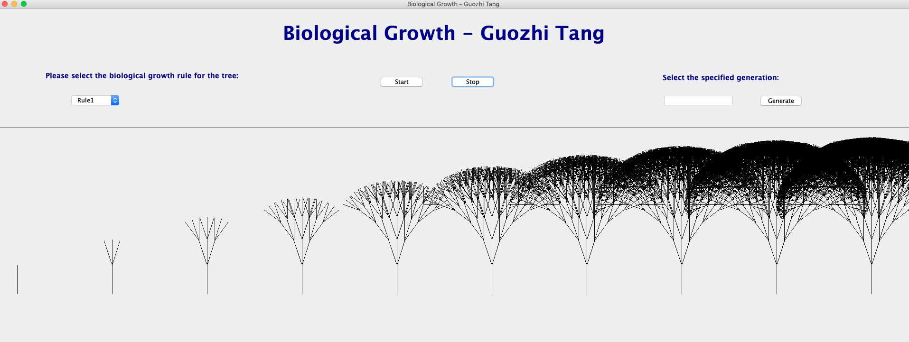

# Biological Growth
 <br>

Adopted **Java Swing** to build an Java application that implemented an example of Genetic Algorithm - Biological Growth: shows the genetic growth process for different types of trees.

Application started with generation 0 from which successive generations were bred. In each generation new organisms were given birth to which were based, genetically, on the organisms which were fit for rules.

The basic idea behind GAs is to model the search for a solution in the same way that organisms in nature are adapted to their environment and lifestyle.

## Getting Started

These instructions will get you a copy of the project up and running on your local machine for development and testing purposes.

### Prerequisites

* Your OS should have Java and have configured its environment
    * Java Environment Configurations for MacOS and Windows10 can both be found at my Gitbook: [Guozhi_GitBook](https://app.gitbook.com/@tangguozhi53/s/guozhi-programming-notes/configuration-tutorials/1.1-java-environment-settings)

## Running the project

* There are two ways to run the project

    * The first method is to run `src/edu/neu/csye6200/bg/BGPanel.java` directly on IDE.
    
    * The second method is to run relevant .jar file of this project
    
        * In the project route, go to `./out/artifacts/Biological_Growth_jar/Biological Growth.jar`.
        ```Bash
        cd ./out/artifacts/Biological_Growth_jar
        ```
      
        * If .jar file is not found here, export the .jar file of this project in IDE.

        * Then there are two ways to run the `Biological Growth.jar` file:

            * Run it on Terminal or CMD:

            ```Bash
            java -jar iological Growth.jar
            ```
  
            * Or double click the file directly
            
* Here are the three result figures:




## Built With

* [Java](https://www.java.com/en/) - The basic language and environment of this project.
* [Java Swing](https://www.javatpoint.com/java-swing) - A part of Java Foundation Classes (JFC) that is used to create window-based applications.
